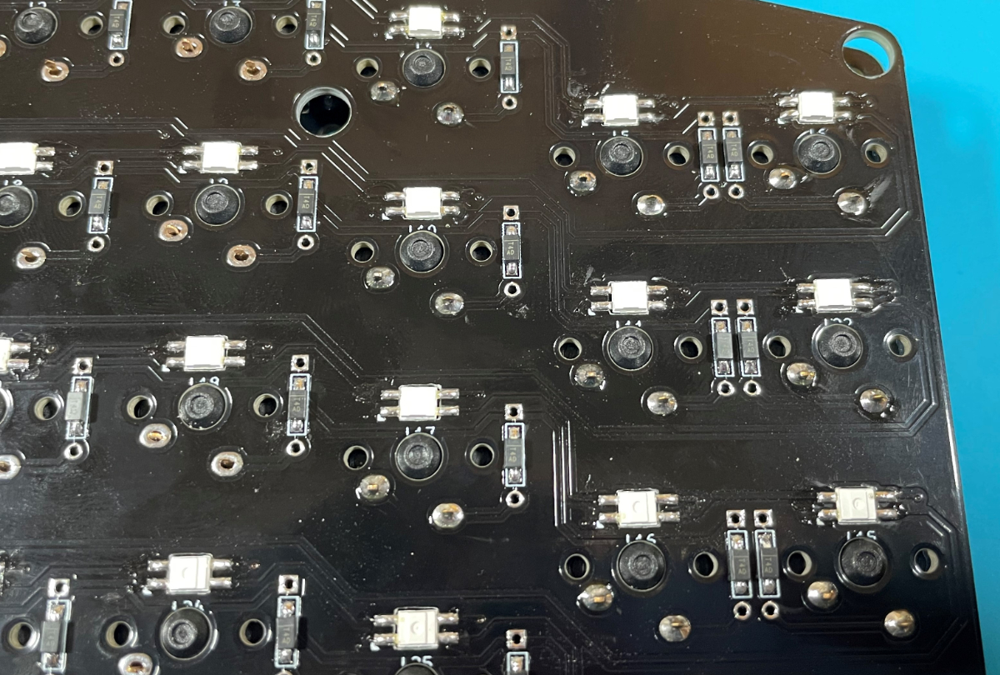

# 左右分割 60% キーボード「RURA66」ビルドガイド


## はじめに

このキーボードは66キーの左右分割型キーボードです。  
部品点数を削り、最小構成は基本要素のみに限定しているため、左右分割ColumnStaggerdを手軽に試してみたい方も利用できます

## 部品リスト


**キット同梱品**

- PCB x1
- トッププレート x1
- ボトムプレート x1
- チップダイオード x66（予備あり）
- リセットスイッチ x2
- TRRSジャック x2
- ProMicro x2
- コンスルーピンヘッダ x4
- ネジ 4mm x40（予備あり）
- スペーサー 7mm x20（予備あり）

**ご自身で買い揃えていただくもの**
（全て遊舎工房で入手できます）

- Cherry MX スイッチ及び互換スイッチ x66
- キーキャップセット（1uのみ。不足は適宜買い足してください）
- RGB_LED YS-SK6812MINI-E x66（オプション）
- USBケーブル
- TRRSケーブル(3極以上)

## 必要な工具


- ハンダゴテ（温度調節可能なもの推奨）
- ピンセット
- ラジオペンチ
- プラスドライバー（2mm）
- 棒ヤスリ

## 作り方の手順

以下、組み立て手順の図は片手側でおこないます。  
RURA66の基板設計は左右専用設計であるため、実装面に沿って作っていただくことが可能です。

### 基板の分離と加工

まずは基板を点線に沿って切り落とします。  
ラジオペンチで掴んで慎重に追ってください。


点線のバリをヤスリがけして整えます。


お好みで、側面を黒の油性ペンで塗るといい感じになります。

### バックライトLEDの取り付け（オプション）

**※この項目はバックライトLEDをオプションで購入し、光らせたい人むけの情報となります。**

（初期ロットのみ）LEDの枠が小さいため、下記の図のようにヤスリで穴を広げます。  
おすすめは100円ショップ等で取り扱いのある三角/四角のダイヤモンドヤスリを使用します。


以下の図のように、LEDの向きをマークにあわせて配置します。全部、向きは一緒になります。  
はんだ付けのときは、270度似設定してください。長時間コテを当てるとLEDが星になります。

一つだけハンダを乗せたら、再度溶かして素早くピンセットで向きを変えます。


なるべく、一つのLEDに熱が入りすぎないように、複数を並行にはんだ付けしていきます。  
はんだ付け完了後、動作確認のため先にProMicroの取り付けと、ライトの点灯チェックを行ってください


### ダイオードの取り付け

ダイオードのパッドに、片側ずつ予備ハンダをします。


ダイオードの向きを揃えて、ピンセットではんだ付けしていきます。  
**※極性注意・・・！！**


全部で33個、同じ向きに配置します。


### TRRSジャックとリセットスイッチの取り付け


TRRSジャックから先に取り付けを行います。  
どちらも同じ面から入れ、裏からはんだ付けします。


### スイッチの取り付け

※初期ロットはGateron等の5ピンに対応しておりません。  
5ピンのスイッチを使用する場合は、足を切る必要があります。

メカニカルスイッチをはんだ付けしていきます。  
まずは、トッププレートにスイッチをはめていきます。


33個はめます。向きはおなじ方向にまとめてください。  
ピンが折れ曲がっている場合は、手でまっすぐに伸ばしてください。

浮かないように、まず対角をはんだ付けします。  
その後、全体的に浮かないように一つずつ確認しながらはんだ付けをしていきます。



### ProMicroの取り付け

付属のピンヘッダは使いません。コンスルーピンヘッダを使用します。


向きを揃えてコンスルーピンヘッダを指します。


ProMicroを載せます。

その後、以下の写真のProMicro側のみ（写真の面のみ）をはんだ付けします。

※メインPCB側は、はんだ付け不要です。


### ボトムプレート、カバープレートの固定

あまり力を入れすぎずに、ラジオペンチとドライバーを使用して固定してください。  
トッププレート、ボトムプレートをスペーサーと連結し、ネジで留めていきます。


### 完成に向けて

ゴム足を4隅につけます。  
お好みのキーキャップを取り付けて完成です。


## QMK Firmwareの書き込み

下記ページよりQMKファームウェアをダウンロードします。

[https://github.com/qmk/qmk_firmware/](https://github.com/qmk/qmk_firmware/)

右上、"Clone or download"ボタンより。

そしてダウンロードしたZIPファイルはお好きなところで展開します。  
フォルダ階層はなるべく浅いほうがいいです。

gitに慣れている方はクローンしていただいても構いません。

環境構築については、こちら[Helixのビルドマニュアル](https://github.com/MakotoKurauchi/helix/blob/master/Doc/firmware_jp.md)が詳しく解説されています。


**ビルドのみ**

```
make rura66:default
```

**ビルドと書き込み**

```
make rura66:default:avrdude
```

これを実行すると本番用のキーマップを書き込めます。  
デフォルトでは以下のようになっています。


キーマップの変更については`keyboards/rura66/keymap/default`をコピーして、お好きなフォルダ名で保存し、変更を行います。

